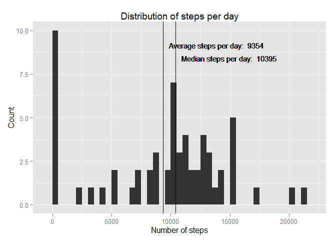

# Reproducible Research: Peer Assessment 1

##Introduction

Large amounts of data are now collected about our movements through out the day. There are a growing number of monitoring devices on the market. We are going to use one such set of data to demonstrate the principal of reproducible research. Below is a paper analyzing steps taken during a two month period, October and November 2012. The idea behind this paper is that everything needed to reproduce the results are all contained together. Writing papers in this way makes it much easier to reproduce and check results found by fellow data scientists and other researchers. With the added benefit that sharing data sets allows for new questions to be asked of existing data.

## Loading and preprocessing the data

As we have alredy discussed these data hold the number of steps taken over the two months. The data are held in a zip file in the same directory as our markdown file.

The activity monitoring data are made up of three columns: *steps*: containing the number of steps in a 5 minute interval; *date*: the date the steps were counted; and *interval*: the start time of the 5 minute interval in the format hhmm.

First load the R libraries we require for this analysis. Then we open the zip file and read the data into a variable called activity.


```r
#Load the libraries we need
library(dplyr)
library(ggplot2)
knitr::opts_chunk$set(fig.path = 'figures/')
```


```r
#Make a connection to a zip file using unz
con <- unz(".\\activity.zip", filename = "activity.csv")

#Read the activity data from the zipped file into the dataframe activity
#Read the date column in the using the Date class
activity <- read.csv(con, 
                     colClasses = c("integer", "Date", "integer"))
```

Let's have a look at the data to get a feel for it.


```r
summary(activity)
```

```
##      steps             date               interval     
##  Min.   :  0.00   Min.   :2012-10-01   Min.   :   0.0  
##  1st Qu.:  0.00   1st Qu.:2012-10-16   1st Qu.: 588.8  
##  Median :  0.00   Median :2012-10-31   Median :1177.5  
##  Mean   : 37.38   Mean   :2012-10-31   Mean   :1177.5  
##  3rd Qu.: 12.00   3rd Qu.:2012-11-15   3rd Qu.:1766.2  
##  Max.   :806.00   Max.   :2012-11-30   Max.   :2355.0  
##  NA's   :2304
```

```r
head(activity)
```

```
##   steps       date interval
## 1    NA 2012-10-01        0
## 2    NA 2012-10-01        5
## 3    NA 2012-10-01       10
## 4    NA 2012-10-01       15
## 5    NA 2012-10-01       20
## 6    NA 2012-10-01       25
```

```r
str(activity)
```

```
## 'data.frame':	17568 obs. of  3 variables:
##  $ steps   : int  NA NA NA NA NA NA NA NA NA NA ...
##  $ date    : Date, format: "2012-10-01" "2012-10-01" ...
##  $ interval: int  0 5 10 15 20 25 30 35 40 45 ...
```

## What is mean total number of steps taken per day?

The total number of steps a day can be found by adding up all the steps from a particular date. The following section of code uses the dplyr package in *r* to group all the data from each day together before adding up the steps.


```r
stepsperday <- activity %>%
    
    #Group together the data for each day
    group_by(date) %>%
    
    #Populate a new column StepsPerDay with the total steps
    #Ignore missing values
    summarize(StepsPerDay = sum(steps, na.rm = TRUE))
```

The summarised data looks like the following:


```r
head(stepsperday)
```

```
## Source: local data frame [6 x 2]
## 
##         date StepsPerDay
## 1 2012-10-01           0
## 2 2012-10-02         126
## 3 2012-10-03       11352
## 4 2012-10-04       12116
## 5 2012-10-05       13294
## 6 2012-10-06       15420
```

Now we find the average number of steps and the median number of steps across the two months.


```r
meanSteps <- mean(stepsperday$StepsPerDay)
medianSteps <- median(stepsperday$StepsPerDay)
```

Let's plot a histogram showing the frequency of particular numbers of steps per day. The plot also shows both the median and mean steps per day.


```r
#Save some labels to be used in the graph
meanLabel <- paste("Average steps per day: ",round(meanSteps,0))
medianLabel <- paste("Median steps per day: ", round(medianSteps))

g <- ggplot(stepsperday, aes(x = stepsperday$StepsPerDay))

#Add a histogram of the data in intervals of 500 steps
g <- g + geom_histogram(binwidth = 500)

#Add title along with x and y labels
g <- g + labs(title="Distribution of steps per day") +
    labs(x="Number of steps", y="Count")

#Show the mean and a label
g <- g + geom_vline(xintercept=meanSteps)
g <- g + geom_text(x = meanSteps + 500, y = 9,
                   hjust=0, vjust=0,
                   size = 4,
                   label = meanLabel)

#Show the median with a label
g<- g + geom_vline(xintercept=medianSteps)
g <- g + geom_text(x = medianSteps + 500, y = 8.25,
                   hjust=0, vjust=0,
                   size = 4,
                   label = medianLabel)

#plot the data
g
```

 

## What is the average daily activity pattern?


## Imputing missing values


## Are there differences in activity patterns between weekdays and weekends?
