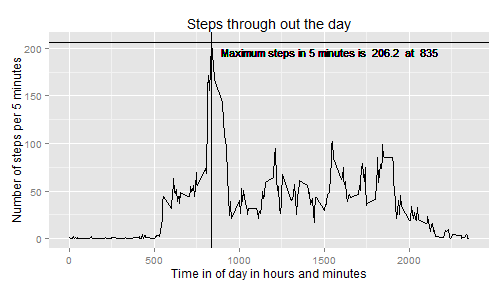
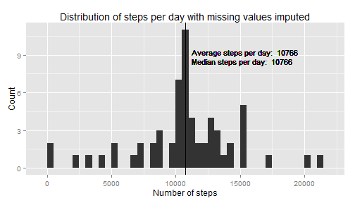

##Introduction

Large amounts of data are now collected about our movements through out the day. There are a growing number of monitoring devices on the market. We are going to use one such set of data to demonstrate the principal of reproducible research. Below is a paper analyzing steps taken during a two month period, October and November 2012. The idea behind this paper is that everything needed to reproduce the results are all contained together. Writing papers in this way makes it much easier to reproduce and check results found by fellow data scientists and other researchers. With the added benefit that sharing data sets allows for new questions to be asked of existing data.

## Loading and preprocessing the data

As we have already discussed these data hold the number of steps taken over the two months. The data are held in a zip file in the same directory as our markdown file.

The activity monitoring data are made up of three columns: *steps*: containing the number of steps in a 5 minute interval; *date*: the date the steps were counted; and *interval*: the start time of the 5 minute interval in the format hhmm.

First load the R libraries we require for this analysis. Then we open the zip file and read the data into a variable called activity.


```r
#Load the libraries we need
library(dplyr)
library(ggplot2)
#knitr::opts_chunk$set(fig.path = 'figure/')
options(scipen = 1, digits = 6)
```


```r
#Make a connection to a zip file using unz
con <- unz(".\\activity.zip", filename = "activity.csv")

#Read the activity data from the zipped file into the dataframe activity
#Read the date column in the using the Date class
activity <- read.csv(con, 
                     colClasses = c("integer", "Date", "integer"))
```

Let's have a look at the data to get a feel for it.


```r
summary(activity)
```

```
##      steps            date               interval   
##  Min.   :  0.0   Min.   :2012-10-01   Min.   :   0  
##  1st Qu.:  0.0   1st Qu.:2012-10-16   1st Qu.: 589  
##  Median :  0.0   Median :2012-10-31   Median :1178  
##  Mean   : 37.4   Mean   :2012-10-31   Mean   :1178  
##  3rd Qu.: 12.0   3rd Qu.:2012-11-15   3rd Qu.:1766  
##  Max.   :806.0   Max.   :2012-11-30   Max.   :2355  
##  NA's   :2304
```

```r
head(activity)
```

```
##   steps       date interval
## 1    NA 2012-10-01        0
## 2    NA 2012-10-01        5
## 3    NA 2012-10-01       10
## 4    NA 2012-10-01       15
## 5    NA 2012-10-01       20
## 6    NA 2012-10-01       25
```

```r
str(activity)
```

```
## 'data.frame':	17568 obs. of  3 variables:
##  $ steps   : int  NA NA NA NA NA NA NA NA NA NA ...
##  $ date    : Date, format: "2012-10-01" "2012-10-01" ...
##  $ interval: int  0 5 10 15 20 25 30 35 40 45 ...
```

## What is mean total number of steps taken per day?

The total number of steps a day can be found by adding up all the steps from a particular date. The following section of code uses the dplyr package in *r* to group all the data from each day together before adding up the steps.


```r
stepsperday <- activity %>%
    
    #Group together the data for each day
    group_by(date) %>%
    
    #Populate a new column StepsPerDay with the total steps
    #Ignore missing values
    summarize(StepsPerDay = sum(steps, na.rm = TRUE))
```

The summarized data looks like the following:


```r
head(stepsperday)
```

```
## Source: local data frame [6 x 2]
## 
##         date StepsPerDay
## 1 2012-10-01           0
## 2 2012-10-02         126
## 3 2012-10-03       11352
## 4 2012-10-04       12116
## 5 2012-10-05       13294
## 6 2012-10-06       15420
```

Now we find the average number of steps and the median number of steps across the two months.


```r
meanSteps <- mean(stepsperday$StepsPerDay)
medianSteps <- median(stepsperday$StepsPerDay)
```

Let's plot a histogram showing the frequency of particular numbers of steps per day. The plot also shows both the median and mean steps per day.


```r
#Save some labels to be used in the graph
meanLabel <- paste("Average steps per day: ",round(meanSteps,0))
medianLabel <- paste("Median steps per day: ", round(medianSteps))

g <- ggplot(stepsperday, aes(x = stepsperday$StepsPerDay))

#Add a histogram of the data in intervals of 500 steps
g <- g + geom_histogram(binwidth = 500)

#Add title along with x and y labels
g <- g + labs(title="Distribution of steps per day") +
    labs(x="Number of steps", y="Count")

#Show the mean and a label
g <- g + geom_vline(xintercept=meanSteps)
g <- g + geom_text(x = meanSteps + 500, y = 9,
                   hjust=0, vjust=0,
                   size = 4,
                   label = meanLabel)

#Show the median with a label
g<- g + geom_vline(xintercept=medianSteps)
g <- g + geom_text(x = medianSteps + 500, y = 8.25,
                   hjust=0, vjust=0,
                   size = 4,
                   label = medianLabel)

#plot the data
g
```

 

As you can see from the graph the average steps per day is 9354 and the median is 10395.

## What is the average daily activity pattern?

The number of steps varies throughout the day. To get a feel for how many steps are taken at different times through the day we are going to take a look at the average number of steps at each time period.


```r
dailyActivity <- activity %>%
    
    #Group together each time period through out the day
    group_by(interval) %>%
    
    #Average the number of steps taken at each time over the two months
    #Ignore missing values
    summarise(avgSteps = mean(steps, na.rm = TRUE))
```

The daily number of steps at different times of the day.


```r
head(dailyActivity)
```

```
## Source: local data frame [6 x 2]
## 
##   interval  avgSteps
## 1        0 1.7169811
## 2        5 0.3396226
## 3       10 0.1320755
## 4       15 0.1509434
## 5       20 0.0754717
## 6       25 2.0943396
```

```r
summary(dailyActivity)
```

```
##     interval       avgSteps     
##  Min.   :   0   Min.   :  0.00  
##  1st Qu.: 589   1st Qu.:  2.49  
##  Median :1178   Median : 34.11  
##  Mean   :1178   Mean   : 37.38  
##  3rd Qu.:1766   3rd Qu.: 52.83  
##  Max.   :2355   Max.   :206.17
```

Here is a plot of the steps over the day.


```r
#Find the maximum number of steps and at what time is occurs
maxsteps <- max(dailyActivity$avgSteps)
maxstepstime <- filter(dailyActivity, avgSteps == maxsteps)
maxLabel <- paste("Maximum steps in 5 minutes is ", 
                  round(maxsteps, 1),
                  " at ", maxstepstime$interval)

g <- ggplot(dailyActivity, aes(x=interval, y=avgSteps))

#Plot the data as a time series
g <- g + geom_line()

#Add titles and labels
g <- g + labs(title = "Steps through out the day") +
    labs(x = "Time in of day in hours and minutes", 
         y = "Number of steps per 5 minutes")

#Show the average maximum steps and the time it occurs
g <- g + geom_vline(xintercept=maxstepstime$interval)
g <- g + geom_hline(yintercept=maxsteps)
g <- g + geom_text(x = maxstepstime$interval + 60,
                   y = maxsteps - 15,
                   hjust=0, vjust=0,
                   size = 4,
                   label = maxLabel)

#plot the graph
g
```

 

The plot shows that the maximum number of steps occurs at 835 and is on average 206.

## Imputing missing values

Ignoring missing values might not give us an accurate picture of what is going on. Ignoring missing values might introduce some bias into the results.

We impute the missing values using the average number of steps at each time period that we generated above.


```r
#Find the location of the missing values
missingSteps <- is.na(activity$steps)
#How many values are we missing?
missingValues <- sum(is.na(activity$steps))
```

There are a total of 2304 missing values from our data set. Below we replace the missing values with the average steps for that time of day, calculated in the previous section.


```r
#Create a vector of replacement step values matching the 
#average step count for that time of day.
replaceSteps <- activity %>%
    
    #select only the missing entries
    filter(missingSteps) %>%
    
    #match the timestamp with the average for that time
    left_join(dailyActivity) %>%
    
    #keep only the vector of replacement averages
    select(avgSteps)
```

```
## Joining by: "interval"
```

```r
#Collect all the step values together with the missing values replaced
imputeSteps <- replace(activity$steps, missingSteps, replaceSteps$avgSteps)

#Create our new dataset then update the steps to the imputed values
activityImpute <- activity
activityImpute$steps <- imputeSteps
```

Now when we see the first few lines of our newly imputed dataset *activityImpute* the missing values are filled in.


```r
head(activityImpute)
```

```
##       steps       date interval
## 1 1.7169811 2012-10-01        0
## 2 0.3396226 2012-10-01        5
## 3 0.1320755 2012-10-01       10
## 4 0.1509434 2012-10-01       15
## 5 0.0754717 2012-10-01       20
## 6 2.0943396 2012-10-01       25
```

Imputing the missing data changes the histogram of steps per day as we can see below.


```r
#Mean number of steps per day
stepsperday <- activityImpute %>%
    
    #Group the days together
    group_by(date) %>%
    
    #Add the steps for the day using the imputed data
    summarize(StepsPerDay = sum(steps, na.rm = TRUE))

#Find the average and median values
meanSteps <- mean(stepsperday$StepsPerDay)
medianSteps <- median(stepsperday$StepsPerDay)

#Start building the plot
meanLabel <- paste("Average steps per day: ",round(meanSteps,0))
medianLabel <- paste("Median steps per day: ", round(medianSteps))

g <- ggplot(stepsperday, aes(x = stepsperday$StepsPerDay))

#Generage a histogram of the frequency of different daily totals
g <- g + geom_histogram(binwidth = 500)

#Add some labels
g <- g + labs(title="Distribution of steps per day with missing values imputed") +
    labs(x="Number of steps", y="Count")

#Show the mean
g <- g + geom_vline(xintercept=meanSteps)
g <- g + geom_text(x = meanSteps + 500, y = 9,
                   hjust=0, vjust=0,
                   size = 4,
                   label = meanLabel)

#Show the median
g<- g + geom_vline(xintercept=medianSteps)
g <- g + geom_text(x = medianSteps + 500, y = 8.25,
                   hjust=0, vjust=0,
                   size = 4,
                   label = medianLabel)

#plot
g
```

 

The mean and median rounded to zero decimal places are the same at 10766. We can see that the imputed data is less skewed toward the lower end of steps per day and the median and mean are close together.


##Are there differences in activity patterns between weekdays and weekends?

There are differences between the pattern of steps taken on weekdays when compared to weekends. We will show some of these differences below.

First let's set up data frame mapping days of the week to weekday or weekend.


```r
weekday <- data.frame(weekdays = c("Monday", "Tuesday", "Wednesday", 
                                   "Thursday", "Friday",
                                   "Saturday", "Sunday"), 
                      weekday = c("weekday", "weekday", "weekday",
                                  "weekday", "weekday",
                                  "weekend", "weekend"))
print(weekday)
```

```
##    weekdays weekday
## 1    Monday weekday
## 2   Tuesday weekday
## 3 Wednesday weekday
## 4  Thursday weekday
## 5    Friday weekday
## 6  Saturday weekend
## 7    Sunday weekend
```

Now we map the dates provided in the dataset to either weekday or weekend.


```r
#Start with the data with the imputed missing data
activityWeekdays <- activityImpute %>%
    
    #Add a column that shows the day of the week 
    #corresponding to that date
    mutate(weekdays = weekdays(activityImpute$date)) %>%

    #Use our weekday dataframe to map our days of the week to
    #weekday or weekend
    left_join(weekday)
```

```
## Joining by: "weekdays"
```

```
## Warning in left_join_impl(x, y, by$x, by$y): joining factor and character
## vector, coercing into character vector
```

```r
head(activityWeekdays)
```

```
##       steps       date interval weekdays weekday
## 1 1.7169811 2012-10-01        0   Monday weekday
## 2 0.3396226 2012-10-01        5   Monday weekday
## 3 0.1320755 2012-10-01       10   Monday weekday
## 4 0.1509434 2012-10-01       15   Monday weekday
## 5 0.0754717 2012-10-01       20   Monday weekday
## 6 2.0943396 2012-10-01       25   Monday weekday
```

Let's compare the steps taken through the day on a weekday to those taken on the weekend. We will take the average steps for each time period for weekdays and weekends separately.


```r
dailyActivity <- activityWeekdays %>%
    
    #We only require steps per interval and weekend or weekday
    select(steps, interval, weekday) %>% 
    
    #We want the average steps for each time of day for weekdays and weekends
    group_by(weekday, interval) %>%
    summarise(avgSteps = mean(steps))

#Plot the weekdays over the weekends for easy comparison.
g <- ggplot(dailyActivity, aes(x=interval, y=avgSteps))

#Timeseries plots
g <- g + geom_line()

#One plot for each of weekday and weekend
g <- g + facet_grid(weekday ~ .)

#Label graphs
g <- g + labs(title = "Steps through out the day by weekday and weekend") +
    labs(x = "Time in of day in hours and minutes", 
         y = "Number of steps per 5 minutes")

#Plot graphs
g
```

 

As we might expect there are some obvious differences in the pattern of steps taken on weekdays when compared to weekends. People tend to take more steps in earlier in the morning starting at around 6am. This peaks as we are seen just after 8:30 before dropping down to a lower numbers.

In contrast to this on the weekend there is a more consistent level of working without the one big peak. After a slower start there are more steps taken on the weekend.

##Conclusion

We have been able to show how steps vary per day as well as over the day. We have shown some difficulties that can arise from ignoring missing values and we shown a difference in weekend walking patterns when compared to weekdays.

Also demonstrated is reproducible work and literate programming. The explanations have been interleaved with the programming code and everything needed to reproduce this work is publicly available.
